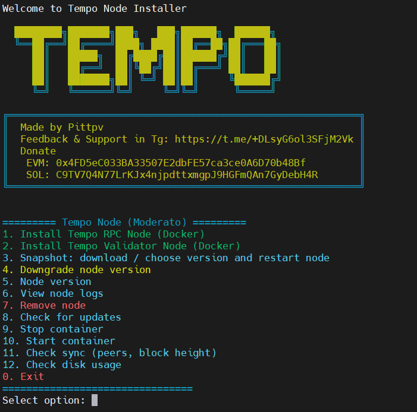

# Tempo — Node installation and management script (RPC and Validator)

**Also in:**
- [🇷🇺 Russian](ru/README.md)
- [🇹🇷 Turkish](tr/README.md)




## Description

This script installs and manages Tempo (moderato, mainnet) nodes: RPC node and Validator node in Docker. It supports fresh installs, snapshot download and extraction, version downgrade, sync and block checks, log viewing, and optional Telegram notifications when long-running tasks finish.

## Features

- 🐳 Install Tempo RPC Node and Validator Node (Docker)
- 📦 Snapshot: choose version, download, extract, restart node
- ⬇️ Downgrade node version
- 🔍 Check sync and blocks (RPC)
- 📋 View node logs
- 🛑 Start/stop containers with status (running / stopped)
- 📨 Optional Telegram notifications when snapshot or downgrade complete
- 🌐 Languages: English, Russian, Turkish

## Functionality

| Feature | Description |
|--------|-------------|
| **RPC / Validator** | Install to `$TEMPO_HOME/rpc` and `$TEMPO_HOME/validator` |
| **Snapshot** | List from API, choose by number, enter URL, or local .tar.lz4 |
| **Downgrade** | Pick version from list or enter tag, restart node |
| **Telegram** | Set TG_BOT_TOKEN and TG_CHAT_ID in .env for notifications after options 3 and 4 |
| **Languages** | EN / RU / TR in script menu |

## Installation and run

1. **Requirements:** Docker and Docker Compose. The script will check and prompt if needed.

2. **Run** — one-line command (download from GitHub, chmod, run):
   ```bash
   curl -o install-tempo.sh https://raw.githubusercontent.com/pittpv/tempo-node/main/install-tempo.sh && chmod +x install-tempo.sh && ./install-tempo.sh
   ```
   For subsequent runs:
   ```bash
   cd $HOME && ./install-tempo.sh
   ```

3. **Configuration:** When you install a node (option 1 or 2), the script **creates** `.env-tempo` in `$TEMPO_HOME`. **Edit that file after installation** if you need to set TEMPO_HOME, ports (RPC_HTTP_PORT, RPC_P2P_PORT, etc.), or **TG_BOT_TOKEN** and **TG_CHAT_ID** for completion notifications.

## Mandatory: use screen or tmux for snapshot and downgrade

**Before running option 3 (Snapshot) or option 4 (Downgrade)**, run the script inside a **screen** or **tmux** session. Downloading and extracting a snapshot takes a long time; if SSH drops, the process will stop. For other options, screen/tmux is not required.

Example:
```bash
screen -S tempo
./install-tempo.sh
# choose 3 or 4; when done you get a Telegram notification if TG_BOT_TOKEN and TG_CHAT_ID are set
```

or:
```bash
tmux new -s tempo
./install-tempo.sh
```

## Main menu

1. Install Tempo RPC Node (Docker)
2. Install Tempo Validator Node (Docker)
3. Snapshot: download / choose version and restart node
4. Downgrade node version
5. Node version
6. View node logs
7. Remove node
8. Check for updates (script)
9. Stop container
10. Start container
11. Check sync and blocks
12. Check disk usage

`0.` Exit

## Step-by-step guide

Detailed installation and Telegram setup:

- [**Tempo-Install-by-Script.md**](en/Tempo-Install-by-Script.md) (English).
- [Russian](ru/Tempo-Install-by-Script.md) · [Türkçe](tr/Tempo-Install-by-Script.md).

## Changelog

<details>
<summary>Updates (click to expand)</summary>

### 2026-03-13 — Installer 2.2.1
- **Downgrade (option 4):** After downloading the node image, the script now asks whether to download a snapshot. If you choose yes, it shows available snapshot versions for the selected chain and lets you pick one (or 0 for latest). If you choose no, the container is restarted with the new image only, keeping existing chain data.
- In the snapshot version menu during downgrade, added option **b** (back) to skip snapshot download and restart with the downloaded image only.
- **Telegram notifications:** improved completion messages with **server IP**, **finish time**, and nicer formatting (emoji + HTML).

### 2026-03-08 — Installer 2.2.0
- Default node image updated to **Tempo 1.4.0** (T1C network upgrade support: [release v1.4.0](https://github.com/tempoxyz/tempo/releases/tag/v1.4.0)).
- **Downgrade node version** menu now shows **actually available versions** from Docker Hub instead of a fixed list.
- Added **Enter custom tag** option to type an arbitrary tag when choosing a version.

❗️This release is required for the T1C network upgrade with the following activation times:

- Moderato: Monday, March 9th at 16:00 CET (unix timestamp: 1773068400)
- Mainnet: Thursday, March 12th at 16:00 CET (unix timestamp: 1773327600)

Node operators must update before activation, otherwise nodes will fall out of sync with the network.

</details>

## Disclaimer

This script is not an official Tempo product and is provided as is.

## Feedback

Questions about the script, bug reports, or feedback:

https://t.me/+DLsyG6ol3SFjM2Vk

## License

MIT License

## Links

- [Tempo Docs — RPC Node](https://docs.tempo.xyz/guide/node/rpc)
- [Tempo Docs — Validator Node](https://docs.tempo.xyz/guide/node/validator)
- [Snapshots](https://docs.tempo.xyz/guide/node/rpc#manually-downloading-snapshots)
