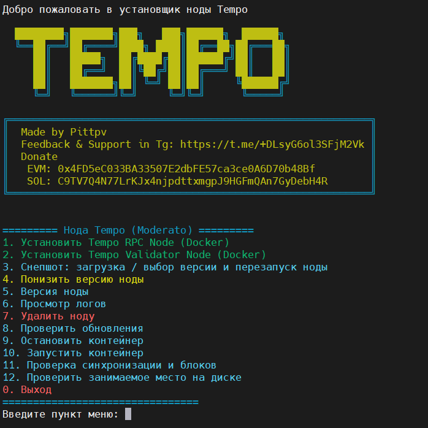

# Tempo — скрипт установки и управления нодой (RPC и Validator)

**Описание на:**
- [🌐 English (main)](../README.md)
- [🇹🇷 Turkish Version](../tr/README.md)




## 📝 Описание

Скрипт предназначен для установки и управления нодами Tempo (moderato, mainnet): RPC-нода и Validator-нода в Docker. Поддерживаются установка с нуля, загрузка и распаковка снапшота, даунгрейд версии, проверка синхронизации, просмотр логов и уведомления в Telegram о завершении длительных операций.

## 🌟 Основные возможности

- 🐳 Установка Tempo RPC Node и Validator Node (Docker)
- 📦 Снапшот: выбор версии, загрузка, распаковка, перезапуск ноды
- ⬇️ Даунгрейд версии ноды
- 🔍 Проверка синхронизации и блоков (RPC)
- 📋 Просмотр логов ноды
- 🛑 Запуск и остановка контейнеров с отображением статуса (работает / остановлен)
- 📨 Опциональные уведомления в Telegram о завершении снапшота и даунгрейда
- 🌐 Языки: английский, русский, турецкий

## 🛠️ Функционал

| Функция | Описание |
|--------|----------|
| **RPC / Validator** | Установка в `$TEMPO_HOME/rpc` и `$TEMPO_HOME/validator` |
| **Снапшот** | Список с API, выбор по номеру, ввод URL или локальный .tar.lz4 |
| **Даунгрейд** | Выбор версии из списка или ввод тега, перезапуск ноды |
| **Telegram** | TG_BOT_TOKEN и TG_CHAT_ID в .env — уведомления о завершении опций 3 и 4 |
| **Языки** | EN / RU / TR в меню скрипта |

## ⚙️ Установка и запуск

1. **Требования:** Docker и Docker Compose. Скрипт проверит наличие и при необходимости подскажет установку.

2. **Запуск** — однострочная команда (скачать с GitHub, назначить права, запустить):
   ```bash
   curl -o install-tempo.sh https://raw.githubusercontent.com/pittpv/tempo-node/main/install-tempo.sh && chmod +x install-tempo.sh && ./install-tempo.sh
   ```
   Для последующих запусков:
   ```bash
   cd $HOME && ./install-tempo.sh
   ```

3. **Конфигурация:** При установке ноды (опция 1 или 2) скрипт **создаёт** файл `.env-tempo` в `$TEMPO_HOME`. **После установки отредактируйте** этот файл при необходимости:
   - `TEMPO_HOME` (по умолчанию `$HOME/tempo`), порты (RPC_HTTP_PORT, RPC_P2P_PORT и т.д.)
   - для уведомлений о завершении снапшота и даунгрейда: **TG_BOT_TOKEN** и **TG_CHAT_ID**

## ⚠️ Обязательная рекомендация: screen / tmux для снапшота и даунгрейда

**Перед выполнением опции 3 (Снапшот) или опции 4 (Даунгрейд)** запускайте скрипт в сессии **screen** или **tmux**. Загрузка и распаковка снапшота занимают много времени; при обрыве SSH процесс прервётся. В остальных случаях использование screen/tmux не обязательно.

Пример:
```bash
screen -S tempo
./install-tempo.sh
# выберите 3 или 4; после завершения получите уведомление в Telegram при настроенных TG_BOT_TOKEN и TG_CHAT_ID
```

или:
```bash
tmux new -s tempo
./install-tempo.sh
```

## 🖥️ Главное меню

1. Установить Tempo RPC Node (Docker)
2. Установить Tempo Validator Node (Docker)
3. Снапшот: загрузка / выбор версии и перезапуск ноды
4. Понизить версию ноды
5. Версия ноды
6. Просмотр логов ноды
7. Удалить ноду
8. Проверить обновления (скрипта)
9. Остановить контейнер
10. Запустить контейнер
11. Проверка синхронизации и блоков
12. Проверить место на диске

`0.` Выход

## 📚 Пошаговая установка

Подробное пошаговое описание установки RPC/Validator, снапшота и настройки Telegram:

- [**Tempo-Install-by-Script.md**](Tempo-Install-by-Script.md) (рус.)
- [English](../en/Tempo-Install-by-Script.md) · [Türkçe](../tr/Tempo-Install-by-Script.md)

## История изменений

<details>
<summary>Обновления (нажмите, чтобы раскрыть)</summary>

### 2026-03-13 — Installer 2.2.1
- **Даунгрейд (опция 4):** После загрузки образа ноды скрипт спрашивает, нужно ли скачивать снепшот. При выборе «да» показываются доступные версии снепшота для выбранной сети и можно выбрать одну (или 0 — последний). При выборе «нет» контейнер перезапускается только с новым образом, без загрузки снепшота, с сохранением текущих данных цепи.
- В меню выбора версии снепшота при даунгрейде добавлена опция **b** (назад) — отказаться от загрузки снепшота и перезапустить ноду только со скачанным образом.
- **Уведомления Telegram:** улучшены сообщения о завершении — добавлены **IP сервера**, **время завершения**, форматирование (эмодзи + HTML).

### 2026-03-08 — Installer 2.2.0
- Образ ноды по умолчанию обновлён до **Tempo 1.4.0** (поддержка апгрейда сети T1C: [релиз v1.4.0](https://github.com/tempoxyz/tempo/releases/tag/v1.4.0)).
- В меню «Понизить версию ноды» выводятся **реально доступные версии** с Docker Hub, без предуказанного списка.
- Добавлена опция «Enter custom tag» для ввода произвольного тега при выборе версии.

❗️Для обновления сети T1C требуется эта версия, активация которой запланирована на следующее время:

- Moderato: понедельник, 9 марта, 16:00 CET (метка времени Unix: 1773068400)
- Mainnet: четверг, 12 марта, 16:00 CET (метка времени Unix: 1773327600)

Операторы узлов должны обновиться до активации, иначе узлы потеряют синхронизацию с сетью.

</details>

## ⚠️ Важно

Скрипт не является официальным продуктом Tempo и предоставляется «как есть».

## ✍️ Обратная связь

Вопросы по работе скрипта, сообщения об ошибках или отзывы:

https://t.me/+DLsyG6ol3SFjM2Vk

## 📜 Лицензия

MIT License

## 🔗 Полезные ссылки

- [Tempo Docs — RPC Node](https://docs.tempo.xyz/guide/node/rpc)
- [Tempo Docs — Validator Node](https://docs.tempo.xyz/guide/node/validator)
- [Snapshots](https://docs.tempo.xyz/guide/node/rpc#manually-downloading-snapshots)
