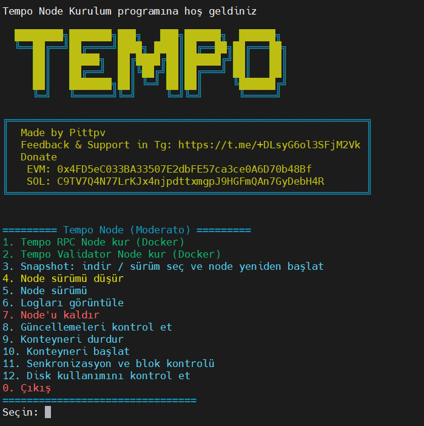

# Tempo — Node kurulum ve yönetim scripti (RPC ve Validator)

**Diğer diller:**
- [🇷🇺 Rusça](../ru/README.md)
- [🌐 İngilizce](../README.md)




## Açıklama

Bu script Tempo (moderato, mainnet) node'larını kurar ve yönetir: Docker'da RPC node ve Validator node. Sıfırdan kurulum, snapshot indirme ve açma, sürüm düşürme, senkronizasyon ve blok kontrolü, log görüntüleme ve uzun süren işlemler bittiğinde isteğe bağlı Telegram bildirimleri desteklenir.

## Özellikler

- 🐳 Tempo RPC Node ve Validator Node kurulumu (Docker)
- 📦 Snapshot: sürüm seçme, indirme, açma, node yeniden başlatma
- ⬇️ Node sürümü düşürme
- 🔍 Senkronizasyon ve blok kontrolü (RPC)
- 📋 Node loglarını görüntüleme
- 🛑 Konteyner başlatma/durdurma ve durum (çalışıyor / durduruldu)
- 📨 Snapshot veya downgrade tamamlandığında isteğe bağlı Telegram bildirimleri
- 🌐 Diller: İngilizce, Rusça, Türkçe

## İşlevler

| İşlev | Açıklama |
|--------|----------|
| **RPC / Validator** | `$TEMPO_HOME/rpc` ve `$TEMPO_HOME/validator` dizinlerine kurulum |
| **Snapshot** | API listesi, numara ile seçim, URL girişi veya yerel .tar.lz4 |
| **Downgrade** | Listeden sürüm seçimi veya etiket girişi, node yeniden başlatma |
| **Telegram** | .env içinde TG_BOT_TOKEN ve TG_CHAT_ID — 3 ve 4 numaralı seçenekler tamamlandığında bildirim |
| **Diller** | Script menüsünde EN / RU / TR |

## Kurulum ve çalıştırma

1. **Gereksinimler:** Docker ve Docker Compose. Script kontrol eder ve gerekirse yükleme önerir.

2. **Çalıştırma** — tek satırlık komut (GitHub'dan indir, chmod, çalıştır):
   ```bash
   curl -o install-tempo.sh https://raw.githubusercontent.com/pittpv/tempo-node/main/install-tempo.sh && chmod +x install-tempo.sh && ./install-tempo.sh
   ```
   Sonraki çalıştırmalarda:
   ```bash
   cd $HOME && ./install-tempo.sh
   ```

3. **Yapılandırma:** Node kurduğunuzda (1 veya 2 numaralı seçenek) script `$TEMPO_HOME` içinde **.env-tempo** dosyasını **kendisi oluşturur**. **Kurulumdan sonra** gerekirse bu dosyayı düzenleyin: TEMPO_HOME, portlar (RPC_HTTP_PORT, RPC_P2P_PORT vb.) veya tamamlanma bildirimleri için **TG_BOT_TOKEN** ve **TG_CHAT_ID**.

## Zorunlu: Snapshot ve downgrade için screen veya tmux

**3 (Snapshot) veya 4 (Downgrade) seçeneğini çalıştırmadan önce** scripti **screen** veya **tmux** oturumunda çalıştırın. Snapshot indirme ve açma uzun sürer; SSH koparsa işlem yarıda kalır. Diğer seçenekler için screen/tmux gerekmez.

Örnek:
```bash
screen -S tempo
./install-tempo.sh
# 3 veya 4 seçin; bittiğinde TG_BOT_TOKEN ve TG_CHAT_ID ayarlıysa Telegram bildirimi alırsınız
```

veya:
```bash
tmux new -s tempo
./install-tempo.sh
```

## Ana menü

1. Tempo RPC Node kur (Docker)
2. Tempo Validator Node kur (Docker)
3. Snapshot: indir / sürüm seç ve node yeniden başlat
4. Node sürümü düşür
5. Node sürümü
6. Node loglarını görüntüle
7. Node kaldır
8. Güncellemeleri kontrol et (script)
9. Konteyneri durdur
10. Konteyneri başlat
11. Senkronizasyon ve blok kontrolü
12. Disk kullanımını kontrol et

`0.` Çıkış

## Adım adım rehber

Kurulum ve Telegram ayarları:

- [**Tempo-Install-by-Script.md**](Tempo-Install-by-Script.md) (Türkçe).
- [Русский](../ru/Tempo-Install-by-Script.md) · [English](../en/Tempo-Install-by-Script.md).

## Değişiklik geçmişi

<details>
<summary>Güncellemeler (görmek için tıklayın)</summary>

### 2026-03-08 — Installer 2.2.0
- Varsayılan node imajı **Tempo 1.4.0** olarak güncellendi (T1C ağ yükseltmesi desteği: [v1.4.0 sürümü](https://github.com/tempoxyz/tempo/releases/tag/v1.4.0)).
- «Node sürümü düşür» menüsünde Docker Hub'dan **gerçek mevcut sürümler** gösteriliyor; önceden sabit liste yok.
- Sürüm seçerken isteğe bağlı etiket girmek için «Enter custom tag» seçeneği eklendi.

❗️Bu sürüm, aşağıdaki etkinleştirme zamanlarıyla T1C ağ yükseltmesi için gereklidir:

- Moderato: 9 Mart Pazartesi, 16:00 CET (Unix zaman damgası: 1773068400)
- Mainnet: 12 Mart Perşembe, 16:00 CET (Unix zaman damgası: 1773327600)

Düğüm operatörleri etkinleştirmeden önce güncelleme yapmalıdır, aksi takdirde düğümler ağ ile senkronizasyon dışı kalacaktır.

</details>

## Önemli

Bu script resmi bir Tempo ürünü değildir ve "olduğu gibi" sunulmaktadır.

## Geri bildirim

Script hakkında sorular, hata bildirimleri veya geri bildirim:

https://t.me/+DLsyG6ol3SFjM2Vk

## Lisans

MIT License

## Bağlantılar

- [Tempo Docs — RPC Node](https://docs.tempo.xyz/guide/node/rpc)
- [Tempo Docs — Validator Node](https://docs.tempo.xyz/guide/node/validator)
- [Snapshots](https://docs.tempo.xyz/guide/node/rpc#manually-downloading-snapshots)
